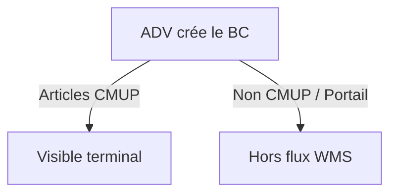

Cette procédure décrit la **création et la saisie d’un Bon de Commande (BC) côté ADV**, depuis la création du document jusqu’à sa validation, en détaillant **toutes les options possibles** et leurs **impacts sur la chaîne logistique, la préparation et la facturation**. 

   
### Règle

La création du Bon de Commande reste **inchangée** sur les points suivants :
- Sélection du client
- Choix du transporteur
- Date de commande
- Conditions tarifaires

Maintenant, la **date de livraison prévue doit impérativement être renseignée** lors de la création du BC.

![[date_de_livraison.png]]

> [!warning] **La date de livraison prévue impérativement renseignée**
> Si elle n’est pas saisie, la date par défaut est : `01/01/1753`
> > [!failure] **Une date non renseignée peut provoquer :** 
> > - des incohérences dans les flux WMS
> > - des anomalies de priorisation ou de planification

### Sélection des articles

Il faut savoir que seuls les articles gérés en stock (CMUP) sont visibles pour les préparateurs.

> [!failure] Les articles non gérés en stock (non CMUP) sont invisibles.
> Exemples : HKPREPAYE, HCOMB, ZREMISE, etc

---
##### Actions à suivre
[[01BC • Informations supplémentaires|✔️ Commande pour articles suivi en stock]]
[[02BC • Articles non-suivi en stock]]
Commande pour des articles programmés avec fournisseur associés
[[02BC • Statut Portail|❌ Commande avec Statut Portail]]

| Type d’article | Exemples                        | Visible terminal | Action ADV         |
| -------------- | ------------------------------- | ---------------- | ------------------ |
| CMUP           | KITGEKOX, HTEL300, BO800RN, ... | ✅                | PL au statut SAISI |
| Non CMUP       | HKPREPAYE, HCOMB, ZREMISE, etc  | ❌                | Procédure manuelle |
| Portail        |                                 | ❌                | Procédure manuelle |

##### Menus
[[00_Home/Accueil|↑ Retour à l'accueil]]

---

---

## 3️⃣ Cas d’une commande fournisseur adossée

### 🔹 Description du cas
- BC client **lié à un BC fournisseur**
- Cas fréquent pour :
  - articles programmés
  - articles non gérés en stock  
- Exemple observé :
  - `HKPREPAYE2`

---

### 🔹 Problématique terrain
- L’article non géré en stock :
  - ❌ n’est **pas visible sur le terminal**
- Le préparateur :
  - ne peut **pas confirmer la réception** via le terminal

---

### 🔹 Procédure opérationnelle (inchangée)

1. Le préparateur réceptionne physiquement la marchandise
2. Il :
   - compte les articles
   - récupère le **BC fournisseur**
3. Il apporte les documents **côté ADV**
4. L’ADV :
   - transforme **immédiatement** les documents en **BL client**
5. Le préparateur repart avec :
   - les BL papier
   - la liste complète des articles (y compris invisibles terminal)

📌 **Responsabilités**
- Préparation assurée par **Florian**
- Bascule des BL client assurée par :
  - Damien  
  - ou Coralie

📌 **Important**
> Aucune modification par rapport à la procédure utilisée jusqu’alors.

---

## 4️⃣ Cas d’une commande contenant une pièce issue d’un kit

### 🔹 Règle obligatoire
Lors de la **création du BC** :

- Si le client commande **une pièce issue d’un kit** :
  - le kit doit être **explosé immédiatement**
  - en autant de **pièces détachées nécessaires**

### ❌ Interdiction
- Ne jamais laisser :
  - un kit partiellement commandé
  - une pièce “fantôme” non décomposée

📌 **Objectif**
- Garantir la visibilité des composants
- Éviter les blocages en préparation
- Assurer la cohérence stock / livraison

---

## ⚠️ Points de vigilance majeurs

- Un article non géré en stock :
  - ❌ n’apparaîtra jamais sur terminal
- Une date de livraison non renseignée :
  - entraîne une date par défaut critique
- Les documents ADV restent **la seule source fiable** dans certains cas
- La rigueur ADV conditionne :
  - la préparation
  - la réception
  - la facturation

---

## 📚 Procédures liées
- Réception fournisseur
- Préparation de commande
- Gestion des articles non gérés en stock
- Gestion des kits

---

## 📝 Historique
- Procédure issue des retours terrain
- Alignée avec les pratiques ADV existantes
- À compléter selon évolutions WMS
