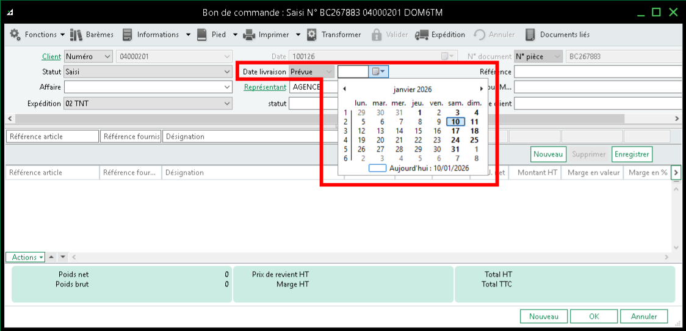

# Création d’un bon de commande

Cette procédure décrit la **création et la saisie d’un Bon de Commande (BC) côté ADV**, depuis la création du document jusqu’à sa validation, en détaillant **toutes les options possibles** et leurs **impacts sur la chaîne logistique, la préparation et la facturation**.

## Règle

La création du Bon de Commande reste **inchangée** sur les points suivants :  

- Sélection du client  
- Choix du transporteur  
- Date de commande  
- Conditions tarifaires  

!!! warning "**La date de livraison prévue impérativement renseignée**"
	Si elle n’est pas saisie, la date par défaut est : `01/01/1753`.  
	Elle sera affichée tout en bas dans la liste des préparations.

## Sélection des articles

Seuls les articles gérés en stock (CMUP) sont visibles pour les préparateurs.

!!!failure "Les articles non gérés en stock (non CMUP) sont invisibles"
	Exemples : HKPREPAYE, HCOMB, ZREMISE, etc

## Checklist

- [ ] Renseigner la date de livraison
- [ ] Vérifier statut du document
- [ ] Ajouter commentaire / instruction logistique
